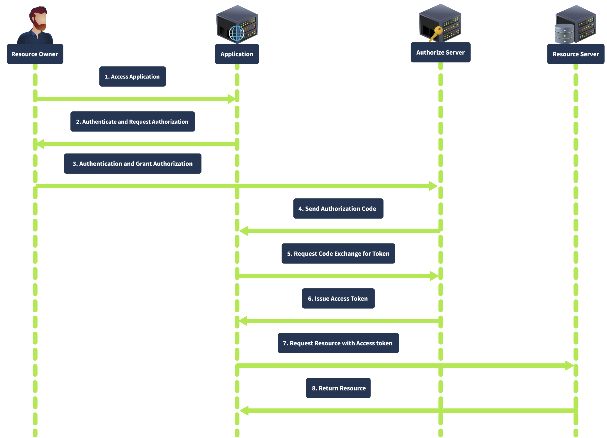
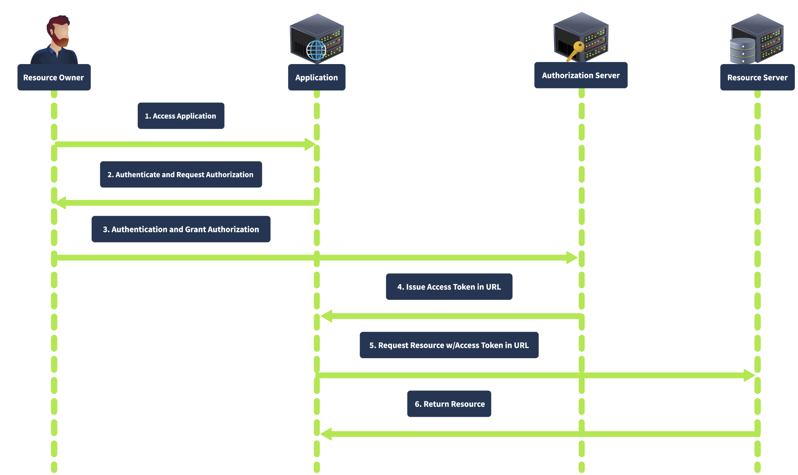
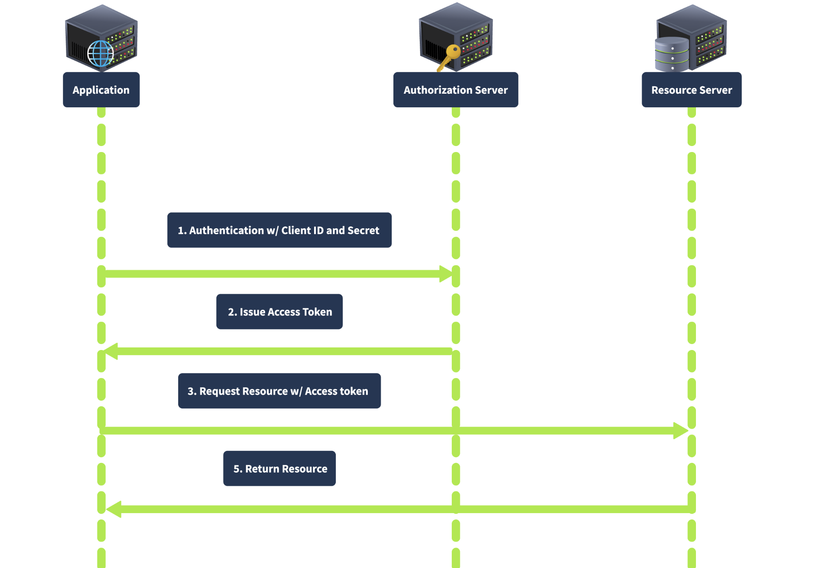
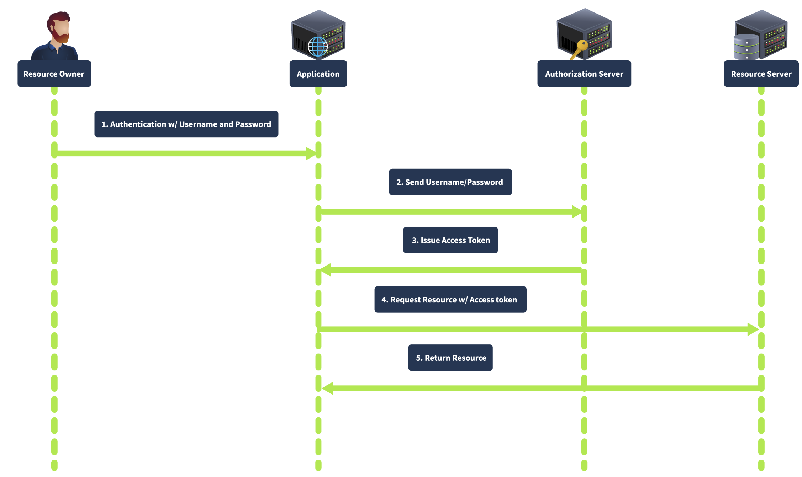

# OAUTH VULNERABILITIES

Room Link: [OAuth Vulnerabilities](https://tryhackme.com/r/room/oauthvulnerabilities)

This room highlighted the key vocabulary for describing the different components in a web application and how they are involved in the authentication and authorization flow. Some of the components are:
    - Resource Owner
    - Client
    - Authorization Server
    - Resource Server
    - Authorization Grant
    - Access Token
    - Refresh Token
    - Redirect URI
    - Scope
    - State Parameter
    - Token & Authorization

## OAuth Flows
- 
- 
- 
- 

## TASK 4-10
After starting up the machine in this room, the reading walked through the code behind the c authenitcation workflow for a WebApp that leverages the OAuth pattern. The questions asked were related to finding out where you encounter the different parameters of the URL in the auth flow. First was finding the client id parameter of the URL and the other was figuring out which parameter set the expiry of the token. Many of the other tasks showed snippits of code that could be used to take advantage of OAuth handshakes that don't include state parameters or provide tokens in plain text during the redirect.